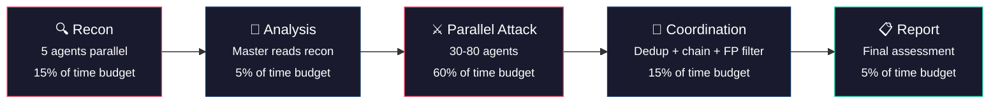
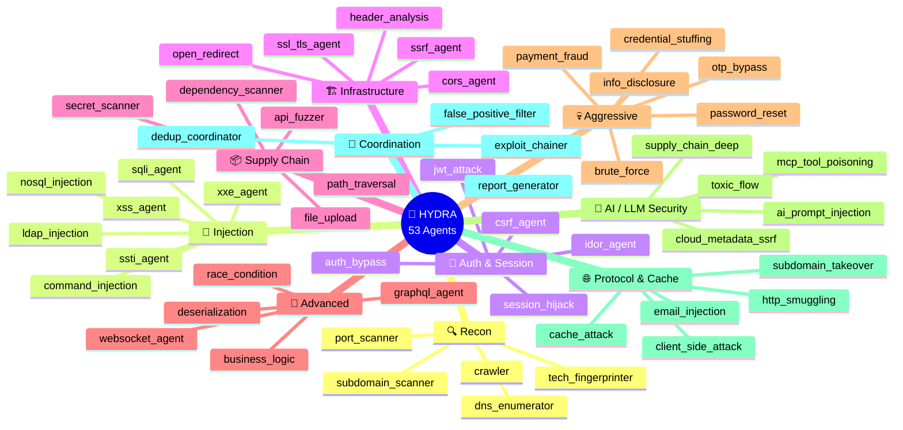

<div align="center">

<br>

<pre>
 ██░ ██▓██   ██▓▓█████▄  ██▀███   ▄▄▄
▓██░ ██▒▒██  ██▒▒██▀ ██▌▓██ ▒ ██▒▒████▄
▒██▀▀██░ ▒██ ██░░██   █▌▓██ ░▄█ ▒▒██  ▀█▄
░▓█ ░██  ░ ▐██▓░░▓█▄   ▌▒██▀▀█▄  ░██▄▄▄▄██
░▓█▒░██▓ ░ ██▒▓░░▒████▓ ░██▓ ▒██▒ ▓█   ▓██▒
 ▒ ░░▒░▒  ██▒▒▒  ▒▒▓  ▒ ░ ▒▓ ░▒▓░ ▒▒   ▓▒█░
 ▒ ░▒░ ░▓██ ░▒░  ░ ▒  ▒   ░▒ ░ ▒░  ▒   ▒▒ ░
 ░  ░░ ░▒ ▒ ░░   ░ ░  ░   ░░   ░   ░   ▒
 ░  ░  ░░ ░        ░       ░           ░  ░
</pre>

### Cut one head — two more spawn.

# AI-Powered Multi-Agent Penetration Testing Framework

<br>

[](https://python.org)
[](https://anthropic.com)
[](#-agent-catalog)
[](LICENSE)
[-000000?style=for-the-badge&logo=owasp&logoColor=white)](https://owasp.org/www-project-top-ten/)
[-red?style=for-the-badge)](https://cwe.mitre.org/top25/)

<br>

**One Opus orchestrator. 53 specialized agents. Real browser attacks. Zero false positives.**

A single Claude Opus master agent dynamically spawns 50–100 specialized security agents that coordinate through shared memory to find, verify, and chain real vulnerabilities — not theoretical ones.

Like the mythological Hydra — the more attack surface it discovers, the more heads it grows.

<br>

[Quick Start](#-quick-start) &#8226; [How It Works](#-how-it-works) &#8226; [Agent Catalog](#-agent-catalog) &#8226; [Web UI](#-web-ui) &#8226; [Configuration](#%EF%B8%8F-configuration)

---


**Only use on targets you have written permission to test.**

</div>

---

## Why Hydra?

Traditional scanners spray signatures. They produce hundreds of "possible" findings with 80%+ false positive rates. Security teams waste days triaging noise.

**Hydra thinks like a pentester:**

- An Opus-class LLM **plans the attack**, decides agent ordering, and adapts mid-scan
- Each agent **actually exploits** the vulnerability before reporting it
- Agents **coordinate** via shared memory — recon informs attacks, attacks inform chaining
- Findings require **proof**: exact request, exact response, reproduction steps
- A browser automation layer **executes JavaScript**, fills forms, solves CAPTCHAs, and captures screenshots

> **Zero tolerance for unverified findings.** Every reported vulnerability was actually exploited.

---

## Key Features

| Feature | Description |
|---|---|
| **53 Specialized Agents** | Purpose-built agents for injection, auth, infra, supply chain, AI/LLM security, and more |
| **Dynamic Orchestration** | Opus master decides agent count, ordering, and parallelism based on attack surface |
| **Real Browser Attacks** | XSS verification, form manipulation, payment fraud testing via cloud browser automation |
| **Shared Memory Coordination** | File-based agent communication — recon feeds attacks, attacks feed chaining |
| **Exploit Chaining** | Automatically combines findings into multi-step attack paths |
| **Evidence-Driven** | Every finding includes proof: HTTP requests/responses, screenshots, PoC scripts |
| **Real-Time Web UI** | D3.js agent graph, live findings stream, SSE-based progress tracking |
| **Bug Bounty Aware** | Parses scope, avoids out-of-scope targets, focuses on impact |
| **OWASP/CWE/CVSS** | Findings mapped to OWASP Top 10 (2021), CWE Top 25 (2025), CVSS v3.1 |
| **Smart Model Routing** | Opus for reasoning, Sonnet for attacks, Haiku for recon — cost-optimized |

---

## How It Works

```
                            Attack Brief
                                 |
                                 v
                    +========================+
                    |     HYDRA MASTER       |
                    |     (Opus Agent)       |
                    |   Plans everything.    |
                    |   Spawns all heads.    |
                    +========================+
                                 |
              +------------------+------------------+
              |                  |                  |
              v                  v                  v
     +--------------+  +--------------+  +--------------+
     |   HEAD 1     |  |   HEAD 2     |  |   HEAD 3     |
     |   Recon      |  |   Attack     |  | Coordination |
     |  (5 agents)  |  | (30-80       |  |  (4 agents)  |
     |              |  |  agents)     |  |              |
     | subdomain    |  | sqli, xss,   |  | dedup        |
     | port_scan    |  | auth_bypass, |  | exploit_chain|
     | tech_finger  |  | ssrf, jwt,   |  | fp_filter    |
     | dns_enum     |  | race_cond,   |  | report_gen   |
     | crawler      |  | graphql ...  |  |              |
     +--------------+  +--------------+  +--------------+
              |                  |                  |
              +-------+  +------+------+  +--------+
                      |  |             |  |
                      v  v             v  v
              +================================+
              |         SHARED MEMORY          |
              |  endpoints | findings | claims |
              |  attack_surface | exploit_chains|
              +================================+
                               |
                               v
                      +----------------+
                      |  FINAL REPORT  |
                      |  CVSS + Proof  |
                      | + Kill Chains  |
                      +----------------+
```

### Phase Breakdown



### The Hydra Effect

The master orchestrator adapts dynamically based on what it discovers:

```
Found PHP + MySQL?    → Spawn sqli_agent, ssti_agent, file_upload_agent, path_traversal_agent
Found JWT auth?       → Spawn jwt_attack_agent, auth_bypass_agent, session_hijack_agent
Found GraphQL?        → Spawn graphql_agent, idor_agent, injection agents with GQL payloads
Found payment system? → Spawn payment_fraud_agent, race_condition_agent, business_logic_agent
Found AI/LLM?        → Spawn ai_prompt_injection_agent, mcp_tool_poisoning_agent, toxic_flow_agent
Found cloud infra?    → Spawn ssrf_agent, cloud_metadata_ssrf_agent, secret_scanner
```

**More attack surface discovered = more heads spawned.** Each head specializes. Each head coordinates.

---

## Agent Catalog

### 53 agents across 10 categories



### Model Routing — Cost Optimized

| Tier | Model | Agents | Why |
|---|---|---|---|
| **🧠 Reasoning** | Opus | Master orchestrator, exploit_chainer, business_logic, report_generator, ai_prompt_injection, toxic_flow | Complex reasoning, multi-step planning |
| **⚔️ Attack** | Sonnet | Injection, auth, infrastructure, supply chain, advanced, MCP/cloud | Good balance of capability and cost |
| **🔍 Recon** | Haiku | subdomain_scanner, port_scanner, tech_fingerprinter, dns_enumerator, crawler | High-volume, simple tasks — cheap |

---

## Quick Start

### Prerequisites

- Python 3.10+
- [Claude Code](https://docs.anthropic.com/en/docs/claude-code) CLI or VS Code extension (for auth)
- OR set `ANTHROPIC_API_KEY` environment variable

### Install

```bash
git clone https://github.com/jainsee24/hydra.git
cd hydra
pip install -r requirements.txt
```

### Run — Web UI (Recommended)

```bash
python main.py web --port 5002
# Open http://localhost:5002
```

### Run — CLI

```bash
# Quick scan
python main.py scan -i "Target: https://example.com. Tech: PHP/MySQL. Focus on SQLi and auth bypass."

# From a brief file
python main.py scan -i @brief.txt --duration 30min --aggressiveness aggressive

# Full assault
python main.py scan \
  -i "https://shop.example.com — e-commerce, Razorpay payments, test everything" \
  --model opus \
  --max-agents 100 \
  --duration 1hr \
  --aggressiveness aggressive
```

### Optional: Browser Automation

For agents that need real browser interaction (XSS verification, form filling, CAPTCHA solving):

```bash
npm install -g agent-browser
agent-browser install
export BROWSER_USE_API_KEY="bu_..."
```

---

## Web UI

Real-time visibility into every head of the Hydra:

```
+-------------------------------------------------------------------+
|  🐉 HYDRA Security Scanner                        [Launch Attack] |
+-------------------------------------------------------------------+
|  Config       |  Agent Graph (D3.js)     |  Agent Activity        |
|  +---------+  |                          |                        |
|  | Brief   |  |      [master]            |  > sqli_agent          |
|  | Duration|  |     /   |   \           |    Testing endpoint    |
|  | Model   |  |   [recon] [attack]      |    /api/users?id=      |
|  +---------+  |   / | \   / | \         |                        |
|               |  s  p  t  s  x  a       |  > xss_agent           |
|  Stats        |                          |    Found reflected XSS |
|  +---------+  +------ Tabs -------------+|    in search param     |
|  | C: 2    |  | Log | Findings | Report ||                        |
|  | H: 5    |  |                          |  > auth_bypass_agent   |
|  | M: 3    |  | [CRITICAL] SQLi in      |    Testing JWT none    |
|  | L: 1    |  |   /api/users            |    algorithm attack    |
|  | Agents  |  | [HIGH] XSS in search    |                        |
|  |   47    |  | [HIGH] IDOR in /api/    |                        |
|  +---------+  |   orders/{id}           |                        |
+-------------------------------------------------------------------+
```

**Features:**
- Real-time SSE event streaming
- D3.js force-directed graph of agent spawning and lifecycle
- Live findings with severity filtering (Critical / High / Medium / Low)
- Phase progress tracking (Recon -> Analysis -> Attack -> Coordination -> Report)
- Interactive modal — agents ask for credentials, OTP codes, scope clarifications
- Stats dashboard: findings by severity, agents spawned, endpoints discovered
- Download final report as Markdown

---

## Configuration

### Aggressiveness Levels

| Level | Behavior |
|---|---|
| `passive` | Observe only — no payloads sent, just fingerprinting and analysis |
| `active` | Crafted requests with common payloads — standard pentest behavior |
| `aggressive` | Full payloads, brute force, credential stuffing, rate limit testing |

### Duration Presets

| Preset | Use Case |
|---|---|
| `15min` | Quick smoke test — recon + top vulnerabilities |
| `30min` | Standard scan — full recon + targeted attacks |
| `1hr` | Deep scan — all agent categories, exploit chaining |
| `2hr` | Comprehensive — includes business logic, race conditions |
| `4hr` | Full assessment — everything, multiple iterations |

### Attack Brief Examples

```
# Bug bounty
Target: https://app.example.com
Scope: *.example.com, api.example.com
Out of scope: blog.example.com, status.example.com
Auth: admin@test.com / TestPass123
Tech stack: Next.js, Node.js, PostgreSQL, AWS
Focus: Authentication bypass, IDOR, SSRF

# E-commerce
Target: https://shop.example.com
Tech: React frontend, Django REST API, Stripe payments
Test: Payment manipulation, cart logic, coupon abuse, IDOR on orders
Credentials: buyer@test.com / Test1234, seller@test.com / Test5678

# API-only
Target: https://api.example.com/v2
Auth: Bearer eyJhbGciOiJIUzI1NiJ9...
OpenAPI spec: https://api.example.com/docs
Focus: Broken access control, rate limiting, injection in all endpoints
```

---

## Shared Memory

Agents coordinate through a file-based shared memory system — no Redis or external databases.

```
workspace/{run_id}/.shared_memory/
  ├── discovered_endpoints.json    # URLs found by recon agents
  ├── discovered_technologies.json # Tech stack fingerprinting
  ├── findings.json                # All verified vulnerabilities
  ├── agent_claims.json            # Prevents duplicate work
  ├── attack_surface.json          # Complete surface map
  ├── exploit_chains.json          # Multi-step attack paths
  └── user_answers.json            # Credentials & OTP codes from user
```

**Flow:**
1. **Recon agents** discover endpoints and technologies
2. **Master** reads the surface, spawns targeted attack heads
3. **Attack agents** claim targets (no overlap), exploit, write findings with proof
4. **Coordination agents** deduplicate, chain exploits, filter false positives
5. **Report generator** produces final assessment with CVSS scores

All writes are atomic (temp file + rename) with `fcntl` file locking.

---

## Finding Format

Every finding requires proof of exploitation — no exceptions:

```json
{
  "id": "FINDING-042",
  "title": "SQL Injection in /api/users endpoint",
  "severity": "critical",
  "cvss_score": 9.8,
  "cvss_vector": "CVSS:3.1/AV:N/AC:L/PR:N/UI:N/S:U/C:H/I:H/A:H",
  "cwe": "CWE-89",
  "owasp": "A03:2021 Injection",
  "proof_type": "exploited",
  "exact_request": "GET /api/users?id=1' UNION SELECT username,password FROM users--",
  "exact_response": "HTTP/1.1 200 OK\n{\"users\": [{\"username\": \"admin\", \"password\": \"$2b$12$...\"}]}",
  "reproduction_steps": [
    "1. Send GET to /api/users?id=1' UNION SELECT username,password FROM users--",
    "2. Observe full user table dump in response",
    "3. Password hashes can be cracked offline"
  ],
  "impact": "Full database read access. Attacker can extract all user credentials.",
  "remediation": "Use parameterized queries: db.query('SELECT * FROM users WHERE id = ?', [id])"
}
```

---

## Project Structure

```
hydra/
  ├── main.py               # CLI entry point (web + scan commands)
  ├── web.py                # Flask web UI with SSE streaming
  ├── pipeline.py           # Pipeline executor — builds prompt, launches master, streams events
  ├── config.py             # ScanConfig + model routing
  ├── shared_memory.py      # File-based agent coordination (atomic JSON read/write)
  ├── requirements.txt      # flask, claude-agent-sdk
  ├── agents/
  │   └── definitions.py    # 53 agent definitions (5000+ lines of security prompts)
  ├── prompts/
  │   └── master_orchestrator.py  # Master agent system prompt builder
  ├── browser/
  │   └── __init__.py       # agent-browser CLI integration docs
  ├── templates/
  │   └── index.html        # Web UI — vanilla JS + D3.js (2500+ lines)
  └── workspace/            # Scan outputs (per-run directories)
      └── {timestamp}/
          ├── report.md
          ├── findings/
          └── .shared_memory/
```

**Dependencies:** 2 packages. That's it.

```
flask>=3.0
claude-agent-sdk
```

**Auth:** Inherits from Claude Code session automatically — no API key config needed. Falls back to `ANTHROPIC_API_KEY` env var if set.

---

## Security Standards Coverage

### OWASP Top 10 (2021) — Full Coverage

| # | Category | Hydra Agents |
|---|---|---|
| A01 | Broken Access Control | idor_agent, auth_bypass_agent, cors_agent, path_traversal_agent |
| A02 | Cryptographic Failures | ssl_tls_agent, secret_scanner, header_analysis_agent |
| A03 | Injection | sqli_agent, xss_agent, command_injection_agent, ssti_agent, xxe_agent, ldap_injection_agent, nosql_injection_agent |
| A04 | Insecure Design | business_logic_agent, race_condition_agent, payment_fraud_agent |
| A05 | Security Misconfiguration | header_analysis_agent, cors_agent, ssl_tls_agent, info_disclosure_agent |
| A06 | Vulnerable Components | dependency_scanner, supply_chain_deep_agent |
| A07 | Auth Failures | auth_bypass_agent, jwt_attack_agent, brute_force_agent, credential_stuffing_agent, otp_bypass_agent, password_reset_agent |
| A08 | Data Integrity Failures | deserialization_agent, dependency_scanner, supply_chain_deep_agent |
| A09 | Logging & Monitoring | info_disclosure_agent, header_analysis_agent |
| A10 | SSRF | ssrf_agent, cloud_metadata_ssrf_agent |

### Beyond OWASP — Modern Attack Surface

| Category | Agents |
|---|---|
| AI/LLM Security | mcp_tool_poisoning_agent, ai_prompt_injection_agent, toxic_flow_agent |
| API Security | graphql_agent, api_fuzzer, websocket_agent, realtime_channel_agent |
| Protocol Attacks | http_smuggling_agent, cache_attack_agent, email_injection_agent |
| Client-Side | client_side_attack_agent, subdomain_takeover_agent, open_redirect_agent |

---

## How Hydra Compares

| Feature | Hydra | Burp Suite Pro | OWASP ZAP | Nuclei |
|---|---|---|---|---|
| AI-driven attack planning | **Yes** | No | No | No |
| Dynamic agent orchestration | **Yes** | No | No | No |
| Real browser exploitation | **Yes** | Partial | No | No |
| Automatic exploit chaining | **Yes** | Manual | No | No |
| Evidence-only findings | **Yes** | No | No | No |
| Business logic testing | **Yes** | Manual | No | No |
| AI/LLM security testing | **Yes** | No | No | Limited |
| False positive rate | **~0%** | ~20% | ~40% | ~15% |
| Setup | `pip install` | License + setup | Moderate | Easy |
| Cost model | Pay per scan | $449/yr | Free | Free |

---

## Responsible Use

> **Hydra is a weapon. Use it responsibly.**

- Only scan targets you have **explicit written authorization** to test
- Respect **scope boundaries** defined in bug bounty programs
- Use `passive` aggressiveness for initial reconnaissance
- All agents enforce scope checks before sending payloads
- Findings include responsible disclosure guidance

**Hydra does NOT:**
- Perform denial-of-service attacks
- Exfiltrate real user data
- Operate outside defined scope
- Store or transmit discovered credentials

---

## Contributing

Contributions welcome. Areas of interest:

- **New agent definitions** — Emerging attack vectors, new protocols
- **Browser attack recipes** — Complex multi-step browser exploits
- **Report formats** — PDF, HTML, SARIF, Jira integration
- **CI/CD integration** — GitHub Actions, GitLab CI security gates

```bash
git clone https://github.com/jainsee24/hydra.git
cd hydra
pip install -r requirements.txt
python main.py web --port 5002
```

---

## Star History

[](https://star-history.com/#jainsee24/hydra&Date)

---

## License

MIT License — See [LICENSE](LICENSE) for details.

---

<div align="center">

<br>

```
   Cut one head, two more shall take its place.
```

**Built with [Claude Agent SDK](https://docs.anthropic.com/en/docs/claude-code) by Anthropic**

<br>

**If Hydra finds real bugs — [star the repo](https://github.com/jainsee24/hydra).**

<br>

</div>
